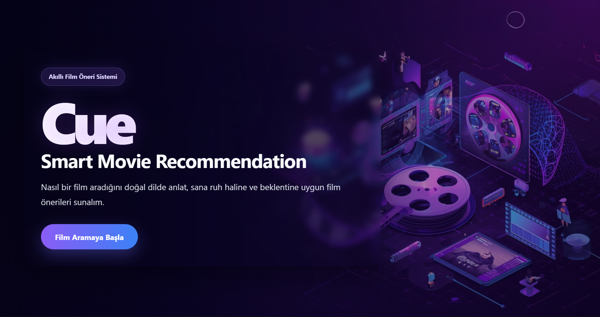
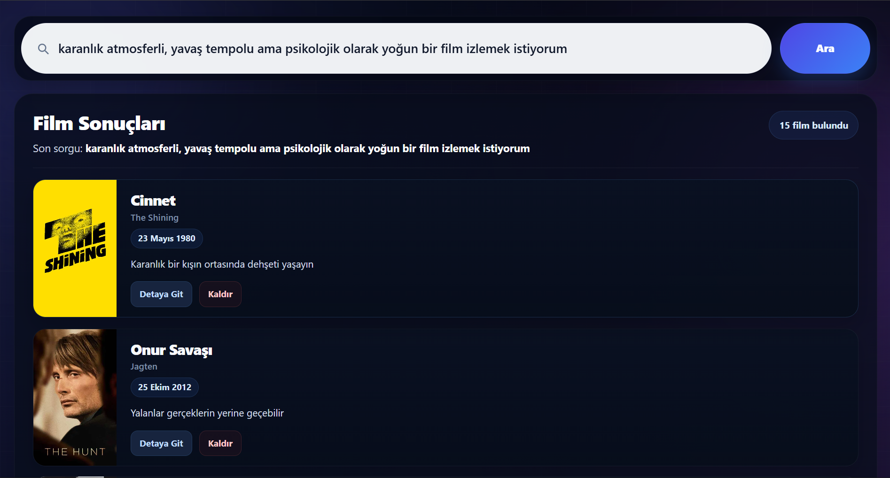
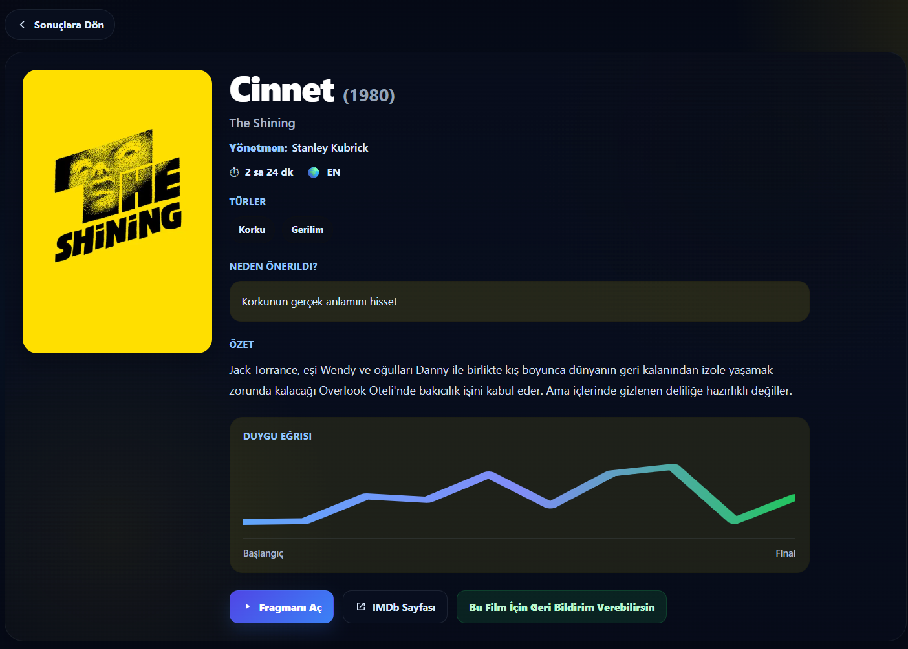
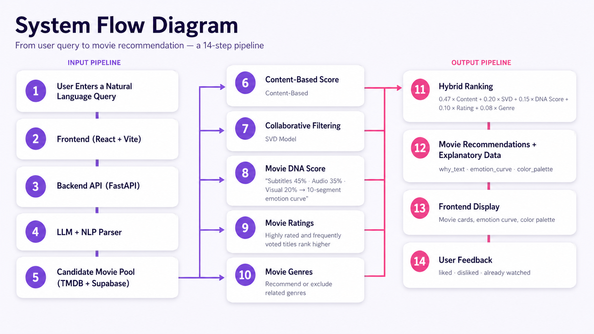
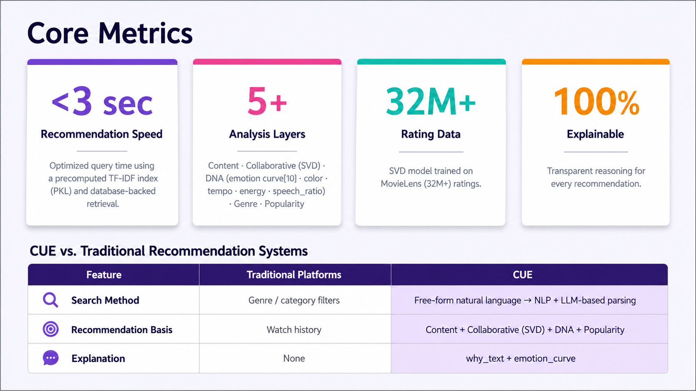

<div align="center">


# CUE — Smart Movie Recommendation System

**_"Don't find the movie. Find the feeling."_**

An AI-powered, atmosphere-driven and personalized movie discovery experience.  
A system that understands feelings, not just films.

[](https://python.org)
[](https://fastapi.tiangolo.com)
[](https://react.dev)
[](https://supabase.com)
[](LICENSE)

</div>

---

## Screenshots

### Homepage


### Natural Language Search Example
> *"I want to watch a dark, slow-paced but psychologically intense movie."*





### System Flow Diagram


### Key Metrics


---

## Problem & Solution

### Problem
Users spend hours searching for something to watch but can't find the right content. Existing platforms offer only shallow recommendations based on genre and watch history — the **feel** and atmosphere of a film is completely ignored.

### CUE's Solution
The user types a free-form sentence. CUE analyzes it and returns personalized, meaningful recommendations. **Emotion and atmosphere come first, not genre.**

> **Example query:** *"A 90s horror film with little blood and a twist ending"* — CUE understands and finds it.

| Feature | Traditional Platform | CUE |
|---|---|---|
| Search Method | Genre / category filter | Free natural language → NLP + LLM parsing |
| Recommendation Basis | Watch history | Content + Collaborative (SVD) + DNA + Popularity |
| Explanation | None | `why_text` + `emotion_curve` |

---

## Key Metrics

| Metric | Value | Description |
|---|---|---|
| Recommendation Speed | **< 3s** | Precomputed TF-IDF index (PKL) + optimized DB queries |
| Analysis Layers | **5+** | Content · Collaborative (SVD) · DNA · Genre · Popularity |
| Rating Data | **32M+** | SVD model trained on MovieLens dataset |
| Explainability | **100%** | Transparent `why_text` justification for every recommendation |

---

## System Flow

From user query to movie recommendation — **14-step pipeline:**

| Step | Component | Description |
|---|---|---|
| 1 | User Input | Free-form natural language query |
| 2 | Frontend | React + Vite |
| 3 | Backend API | FastAPI |
| 4 | LLM + NLP Parser | Query → `parsed_filters` (JSON) |
| 5 | Candidate Pool | TMDB + Supabase |
| 6 | Content Score | Content-Based Filtering |
| 7 | User Score | Collaborative Filtering (SVD) |
| 8 | DNA Score | 16-dim vector: `emotion_curve[10]` + `[tempo, energy, speech_ratio, brightness, saturation, warmth]` |
| 9 | Popularity Score | High-rated and widely voted films ranked higher |
| 10 | Genre Score | Relevant genre boosting |
| 11 | Hybrid Ranking | `0.47×content + 0.20×SVD + 0.15×DNA + 0.10×score + 0.08×genre` |
| 12 | Recommendation Output | `why_text` · `emotion_curve` · `color_palette` |
| 13 | Frontend Display | Movie cards, emotion curve, color palette |
| 14 | User Feedback | liked · disliked · already watched → fed back into SVD |

---

## Technical Architecture

### 1. LLM & NLP Parser — `ai_parser.py`

**Natural Language → Structured Filter**

The user query is analyzed via Groq API (LLM) and an NLP pipeline, then decomposed into `genre`, `era`, `emotion`, and `theme` filters.

- **Output:** `parsed_filters` (JSON)
- **Stack:** Groq API · NLP pipeline

---

### 2. Film DNA Engine — `audio.py` + `visual.py`

**Audio, Visual & Subtitle Pre-Processing**

For each film, data is collected from three sources and concatenated into a **16-dimensional DNA vector** that is precomputed and stored in Supabase:

```python
emotion_curve = audio_data["emotion_curve"]   # 10 elements
tempo         = audio_data["tempo"]
energy        = audio_data["energy"]
speech_ratio  = audio_data["speech_ratio"]

brightness    = visual_data["brightness"]
saturation    = visual_data["saturation"]
warmth        = visual_data["warmth"]

vector = emotion_curve + [
    tempo,
    energy,
    speech_ratio,
    brightness,
    saturation,
    warmth
]
```

| Source | Analysis |
|---|---|
|  Audio (YouTube trailer) | Tempo, energy, speech density via Librosa + Whisper |
|  Visual (TMDB poster) | Color palette, brightness, saturation, warmth |
|  Subtitle | Emotion scoring — fear, anger, joy... via HuggingFace |

- **Tools:** Whisper · Librosa · yt-dlp · Subdl · HuggingFace Transformers
- **Storage:** Supabase `film_dna` table

---

### 3. Hybrid Ranking — `ranker.py`

**5-Layer Weighted Ensemble**

```
hybrid = (content × 0.47) + (SVD × 0.20) + (DNA × 0.15) + (score × 0.10) + (genre × 0.08)
```

| Signal | Method | Weight |
|---|---|---|
| Content Similarity | TF-IDF + Cosine Similarity | 0.47 |
| User Behavior | Collaborative Filtering (SVD) | 0.20 |
| Film DNA | 16-dim vector similarity | 0.15 |
| Popularity | TMDB score + vote count | 0.10 |
| Genre Match | Genre alignment | 0.08 |

- **Pipeline:** Candidate → Hybrid Ranking
- **API:** FastAPI

---

### 4. Explainable Recommendation — `explanier.py`

**"Why This Film?" Layer**

For every recommendation, the LLM (Groq API) analyzes the model output and generates a user-specific explanation based on content similarity, emotional tone, themes, and SVD scores. The `emotion_curve` and `color_palette` are also surfaced to make recommendations fully transparent.

- **Output:** `why_text` · `emotion_curve` · `color_palette`
- **DB:** Supabase

---

## Project Structure
```
cue-smart-movie-recommendation-system/
├── assets/
│   └── screenshots/
│       ├── homepage.png
│       ├── search-example.png
│       ├── flow-diagram.png
│       └── metrics.png
├── backend/
│   ├── analysis/
│   │   ├── __init__.py
│   │   ├── audio.py                  # Audio analysis: tempo, energy, speech_ratio
│   │   └── visual.py                 # Visual analysis: color, brightness, warmth
│   ├── ml/
│   │   ├── __init__.py
│   │   ├── collaborative_lite.py     # Collaborative filtering (SVD)
│   │   ├── content_filter.py         # Content-based filtering (TF-IDF)
│   │   ├── dna_scorer.py             # DNA vector scoring
│   │   ├── dna_storage.py            # DNA data storage interface
│   │   ├── explainer.py              # LLM-generated "why this film?" explanations
│   │   └── ranker.py                 # Hybrid scoring engine (5 layers)
│   ├── nlp/
│   │   ├── __init__.py
│   │   └── ai_parser.py              # LLM + NLP: natural language → structured filters
│   ├── precompute/
│   │   ├── __init__.py
│   │   ├── dna_pipeline.py           # DNA precompute pipeline
│   │   ├── pipeline.py               # General precompute pipeline
│   │   └── subtitle_emotion.py       # Subtitle emotion analysis
│   ├── main.py                       # FastAPI entry point
│   ├── recompute_dna_vector.py       # DNA vector recompute script
│   ├── requirements.txt
│   ├── tmdb_client.py                # TMDB API client
│   ├── trailer_fetcher.py            # YouTube trailer downloader (yt-dlp)
│   └── train_tfidf.py                # TF-IDF index training script
├── data/
│   ├── data_prep.py                  # MovieLens dataset filtering & ID mapping
│   └── test_movies_100.json          # Test movie dataset (100 films)
├── frontend/
│   ├── public/
│   │   ├── cue-favicon-tight.ico
│   │   ├── cue-hero.jpeg
│   │   ├── cue-logo.jpeg
│   │   ├── cue-mark.png
│   │   ├── favicon.svg
│   │   ├── icons.svg
│   │   └── landing-bg.jpg
│   ├── src/
│   │   ├── assets/
│   │   ├── components/
│   │   ├── pages/
│   │   ├── utils/
│   │   ├── App.css
│   │   ├── App.jsx
│   │   ├── index.css
│   │   └── main.jsx
│   ├── .env.example
│   ├── .gitignore
│   ├── eslint.config.js
│   ├── index.html
│   ├── package.json
│   ├── package-lock.json
│   ├── requirements_mehmet
│   └── vite.config.js
├── models/
│   ├── svd_lite_model.pkl            # Trained SVD model (MovieLens 32M+)
│   ├── tfidf_matrix.pkl              # Precomputed TF-IDF matrix
│   ├── tfidf_meta.pkl                # TF-IDF metadata
│   └── tfidf_vectorizer.pkl          # TF-IDF vectorizer
├── .gitignore
├── .python-version
├── requirements.txt
└── README.md
```
---

## 👥 Team

| Name | GitHub | Email |
|---|---|---|
| **Ahsen Toker** | [@ahsentoker](https://github.com/ahsentoker) | ahsentoker@gmail.com |
| **Dicle Ürün Dodurga** | [@Dicleern](https://github.com/Dicleern) | dicleurun500@gmail.com |
| **Elif Çal** | [@elifcal](https://github.com/elifcal) | elifcal01@gmail.com |
| **Mehmet Çelik** | [@celikmehmet15](https://github.com/celikmehmet15) | celikmehmet1507@gmail.com |

---

<div align="center">

*"Don't find the movie. Find the feeling."* — **CUE**

</div>
